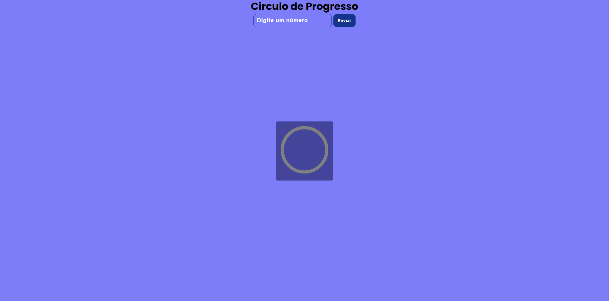
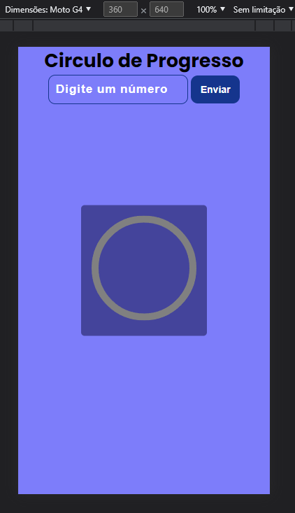

# Projeto Círculo de Progresso:curly_loop:

* Projeto feito em HTML, CSS e JAVASCRIPT.

- Círculo de progresso, mostra a porcentagem que vc deseja ver e a animação da porcentagem representada no círculo.
- Pop-up de aviso caso coloque porcentagem maior que 100%

## Responsivo:sunglasses:

- Totalmente responsivo para qualquer formato de mídia.